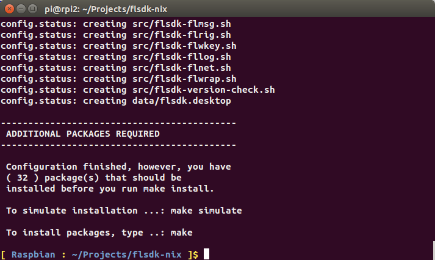
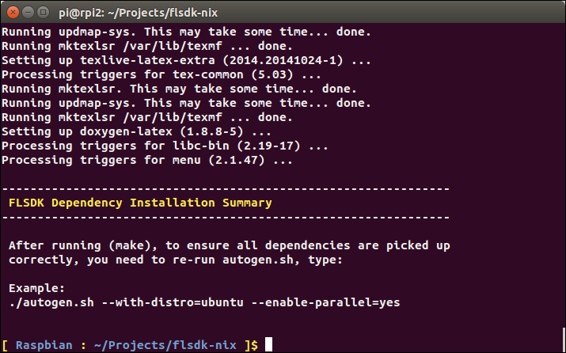
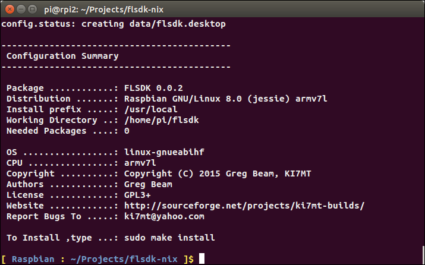
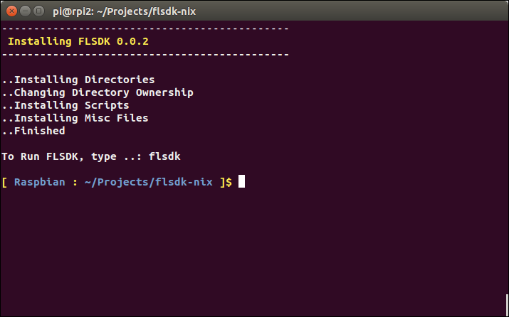
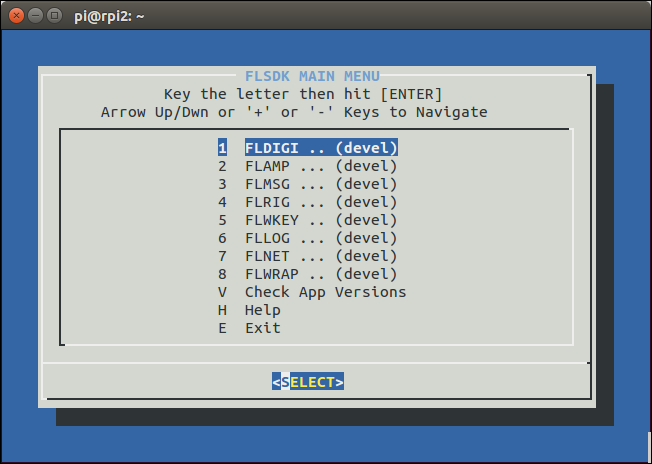
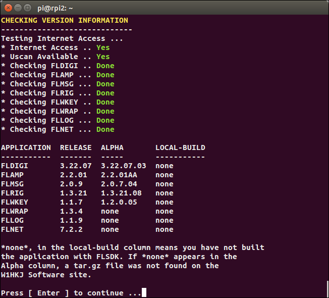
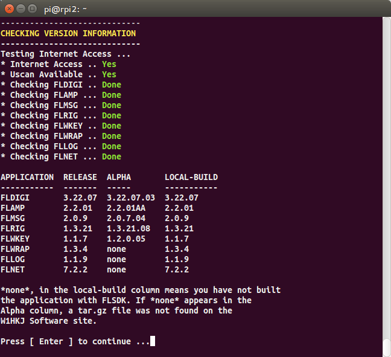

The base {raspbian} image includes a fully functional SSH server. For this guide, 
{prog} installation will be performed through an SSH terminal. For the examples
herein, I will be using {ubuntu-desktop} to provide my SSH client, however,
most any modern Linux distribution that has {openssh} installed should suffice.

If you are using Windows to perform the installation, there are several options
for an SSH client:

* Install {putty}
* Install {cygwin-home} with Openssh
* Install {msys-home} with msys-openssh

CAUTION: None of the Windows SSH solutions are 100% with respect to graphics,
as Windows does not natively support Ncurses. The Graphics quality of the Main
Menu will be degraded somewhat, but is still usable. However, don't expect the
same Graphics quality you enjoy from a native Linux system.

Several sections are marked either [green]*Optional* or [fuchsia]*Recommended*.
With respect to {raspbian}, {prog} will work with either *Wheezy* or *Jessie* 
however, many package updates are available when using *Jessie*. This guide, 
and the testing I performed used *Jessie*, including all of the 
[green]*Optional* and [fuchsia]*Recommended* sections. Sections marked as
[red]*Required* must be performed for proper installation.

Instructions for installing {raspbian} to your SD card can be found at
({raspbian-install}) and will not be covered in this guide. Installation is a
fairly simple process and should only take a few minutes.

.OS Information
The following operating system was used for {raspbian}. Release notes can be
found ({release-notes})

[horizontal]
Install Image:: 2015-02-16-raspbian-wheezy.img
Image Download:: {raspbian-download}
Kernel Version:: 3.18 armv7l

'''

==== ( [red]*Required* ) - Raspbian IP Address
You will need to determine the RPI 2 IP address in order to login after
booting the device. You can get the IP address locally by running ifconfig from
a terminal or if performing the {prog} installation headless (no monitor), login
to your router and get the DHCP IP address> Your looking for raspberrypi or
similar as the name.

CAUTION: If you have multiple RPI devices on the same network, you may need
to adjust the hostname (using raspi-config or manually editing the hosts
files) before connecting to your network in order to avoid hostname collisions.

[source,bash]
-----
# Open a terminal, then type:
ifconfig

# Look for inet addr:
inet addr:192.168.x.xxx  Bcast:192.168.x.xxx Mask:255.255.255.0

# Make a note of the IP Adress for later use.

-----

NOTE: The remainder of this how-too will be performed via SSH terminal. If your
working locally, simply open a terminal and proceed, skipping the SSH Login.

==== ( [green]*Optional*) - Raspbian SSH Login
Using the IP address you obtained previously, in an SSH terminal, log into your
RPI 2 Device.

[source,bash]
-----
# Default Usename....: pi
# Default Password...: raspberry
# Substitute 192.168.x.xxx with your RPI 2 Device IP Address
ssh pi@192.168.x.xxx

# At the password prompt, type
raspberry

-----

'''

==== ( [red]*Required* ) - Raspbian Update Configuration
If you have not already done so, you should set your timezone data, local
language and update you package lists:

[source,bash]
-----
# Set Time Zone Data. For my QTH, I select: US >> Mountain
sudo dpkg-reconfigure tzdata

# Set Local Language. For en_US I select: >> en_US.UTF-8
sudo dpkg-reconfigure locales

# Update package lists
sudo apt-get update

-----

'''

==== ( [green]*Optional*) - Raspbian Additional Configuration Items
Raspbian has a nice package for managing several aspects of the installation. The
program is call raspi-config. The following configuration updates are optional.

[source,bash]
-----
# At the prompt, type:
sudo raspi-config

# Using the menu system, update the following items:
- Expand Hard Drive to full
- Change Root Password
- Under Advanced >> Change Host Name (pick what you like)
- Select <Finish> to exit

# After saving your configuration changes, reboot the device
sudo reboot

-----

CAUTION: The following step is optional. The total time to download and
install the dist-upgrade can take up to an hour to perform. During the
installation portion, the user will be asked to accept the package
maintainers config files. During this build, I selected "Y" or yes to all
the prompts when asked.

'''

==== ( [green]*Optional* ) - Raspbian Upgrade to Debian 8.0 Jessie
Depending on your Internet speed, downloads can take a fare bit of time.
Installing the upgraded packages can take even longer. During my testing,
total download and installation took about (1) hour to complete.

[source,bash]
-----
# Update package list
sudo apt-get update

# Upgrade system ( currently Wheezy )
sudo apt-get upgrade

# Reboot the device
sudo reboot
-----

After rebooting, log back into the system via SSH, then perform the following 
to upgrade to *Jessie*.

[source,bash]
-----
# Edit the system source list with the following command:
sudo sed -i 's/wheezy/jessie/g' /etc/apt/sources.list

# Verify your source list change:
cat /etc/apt/sources.list |grep "deb http"

# Ensure you see the following:
# deb http://mirrordirector.raspbian.org/raspbian/ jessie main contrib non-free rpi

# Update package list for Jessie
sudo apt-get update

# Perform dist-upgrade
sudo apt-get dist-upgrade

# During the upgrade, answer the questions as appropriate. After the
# installation completes, reboot the device:
sudo reboot

-----

'''

==== ( [green]*Optional* ) - Raspbian Update RPI2 Firmware
After logging back into the system via SSH, we'll now perform RPI firmware
update. This is easy to accomplish, as the {raspbian} image provides a tool to
do the update for us.

[source,bash]
-----
# After logging in via SSH, type:
sudo rpi-update

# After the firmware update is finished, reboot the device
sudo reboot

-----

'''

==== ( [fuchsia]*Recommended* ) - Raspbian Package Clean Up
After logging back into the system via SSH, to save on disk space and remove
unneeded packages, the following will clean up the downloaded packages after
dist-upgrade. To read more about each command, see the man page: man apt-get

[source,bash]
-----
# Clean out the local repository of retrieved package files
sudo apt-get clean

# Remove packages that were automatically installed to satisfy
# dependencies for other packages and are now no longer needed
sudo apt-get autoremove
 
----- 

'''

==== ( [red]*Required* ) - Raspbian Prerequisite Install
Before you can download and install {prog}, you will need a couple packages
in order to proceed. These packages are needed in order to process the {prog}
configuration scripts. The remaining development packages will be 
installed during the make process. If you have not already done so, log into
your RPI2 via SSH.

[source,bash]
-----
# In the terminal, type ( or copy & paste ):
sudo apt-get install subversion autoconf lsb-release gcc
-----

NOTE: GCC may already be installed and latest version. On Jessie, the
GCC version, after dist-upgrade is: GCC (Raspbian 4.9.2-10) 4.9.2. lsb-release
was also installed on Jessie but not on Wheezy. Autoconf and subversion are not
install ( by the default manifest ) on either distribution.

'''

==== ( [red]*Required* ) - Raspbian Download Source Code
At this step, we will make the working ( checkout ) directory, and checkout
{prog} from {sf-ki7mt}. Future versions of the build will simply download a
tar.gz file for compiling.

[source,bash]
-----
# In the terminal, type:
mkdir -p ~/Projects
cd ~/Projects
svn co https://svn.code.sf.net/p/ki7mt-builds/code/branches/flsdk-nix
-----

If there were no errors during the checkout phase, you should have a folder
named *flsdk-nix* with the current version of source code from {sf-ki7mt}.

'''

==== ( [red]*Required* ) - Raspbian Configure The Build
At this point, we are ready to configure the build in preparation for installing
the needed packages.

[source,bash]
-----
# In the terminal, type:
cd ~/Projects/flsdk-nix

# Now configure the build, type ( or copy & paste )
./autogen.sh --with-distro=debian --enable-parallel=yes
-----

.Configure Screen

[source,bash]
-----
# If there were no errors, type: make -j4
# Note: if running as RootSudo (pi), you may not be asked for your PW.
# Go get a Cuppa-Tea, as this will take about 20+ Minutes to complete.
make -j4
-----

After running ( make -j4 ), if all went as expected, you will be prompted to
re-run the autogen.sh command. This is to ensure there are no outlying
packages and will perform a final script configuration in preparation
for install.

.After Make

'''

==== ( [red]*Required* ) - Raspbian Re-Run Configure
[source,bash]
-----
# In the terminal, type ( or copy & paste ):
./autogen.sh --with-distro=debian --enable-parallel=yes
-----

.After 2nd Configure

'''

==== ( [red]*Required* ) - Raspbian Run Make Install
If there were no errors, it's time to install {prog}.

[source,bash]
-----
# In the terminal, type:
sudo make install
-----

.Final Install

'''

==== .( [red]*Required* ) - Raspbian Test Installation
If the installation went without error, test that you can launch {prog}.

[source,bash]
-----
# In the terminal, type:
flsdk
-----
.FLSDK Main Menu

If the Main Menu is functional, run the version check.

[source,bash]
-----
# In the Main Menu, select
V Check App Version
-----

.Check App Versions

After building all the the applications, re-run Check App Versions.

.Check App Versions After Build

