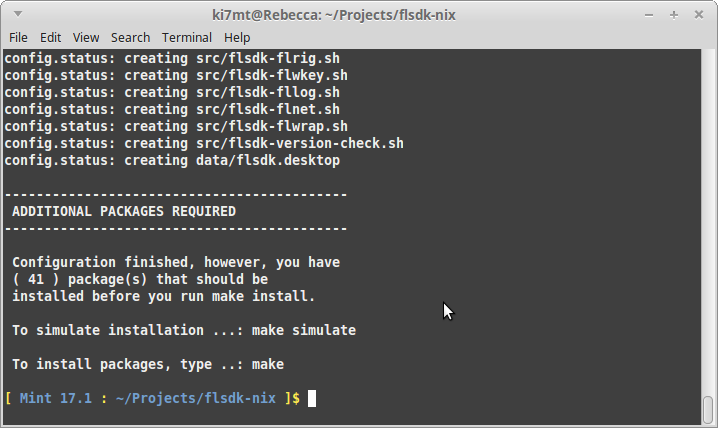
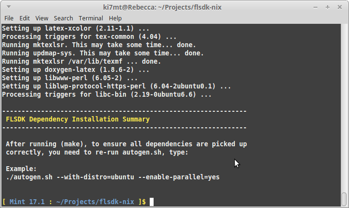
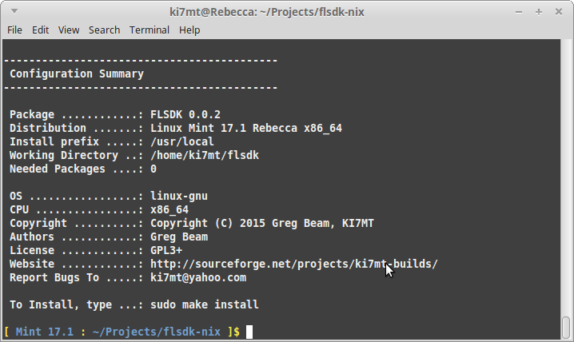
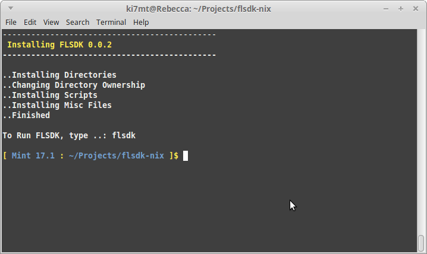
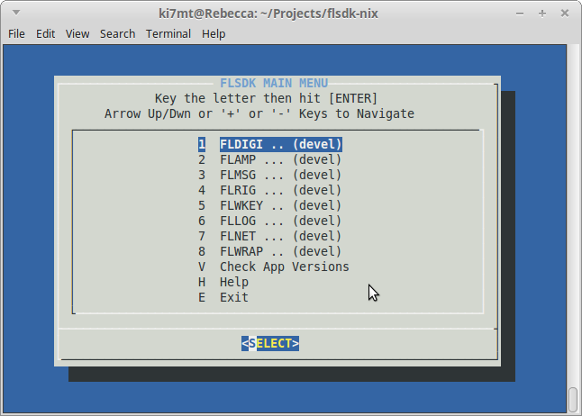
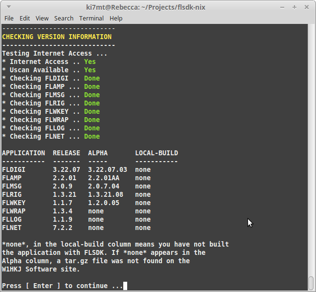

{prog} installation on Mint also straight forward. The OS being used for
this section is Mint 17.1 (Rebecca) with the Mate desktop. Only an initial
update and upgrade was performed before starting the {prog} installatiion process.

'''

==== ( [red]*Required* ) - Mint Prerequisite Install
Before you can download and install {prog}, you will need a couple packages
in order to proceed. These packages are needed in order to process the {prog}
configuration scripts. The remaining development packages will be 
installed during the make process. If you have not already done so, open a
terminal ( +Ctrl+Alt+T+ )

[source,bash]
-----
# In the terminal, type:
sudo apt-get update

# In the terminal, type ( or copy & paste ):
sudo apt-get install autoconf lsb-release
-----

'''

==== ( [red]*Required* ) - Mint Download and Extract Source Tarball
At this step, we will download then extract the source tarball:

[source,bash]
-----
# In the terminal, type:
cd ~/Downloads

# Download the source
wget 'http://sourceforge.net/projects/ki7mt-builds/files/flsdk/flsdk-0.0.3.tar.gz'

# Extract
tar -xf flsdk-0.0.3.tar.gz
-----

If there were no errors during the download and extract, you should have a folder
named *flsdk-0.0.3*. 

'''

==== ( [red]*Required* ) - Mint Configure The Build
At this point, we are ready to configure the build in preparation for installing
the needed packages.

IMPORTANT: If you previously installed {prog} by checking out the source code
from either *SVN* or *Git* repositories, you should uninstall that version before
installing {prog} {revision}. Simply CD to the source folder, and perform a
sudo make uninstall.

[source,bash]
-----
# In the terminal, type:
cd ~/Downloads/flsdk-0.0.3

# Note: There are two enabled options for the basic build:
# --disable-parallel	# Disable parallel compiling
# --disable-docs		# Disablt HTML documentation
#
# It's highly recommened that you leave both enabled, which is the default

# To configure the build, in the terminal type:
./autogen.sh --with-distro=mint

-----

.Configure Screen

[source,bash]
-----
# If there were no errors, type: make
# You should also be asked for your sudo password to perform package installation

make

-----

After running ( make ), if all went as expected, you will be prompted to
re-run the autogen.sh command. This is to ensure there are no outlying
packages and will perform a final script configuration in preparation
for install.

.After Make

'''

==== ( [red]*Required* ) - Mint Re-Run Configure
[source,bash]
-----
# In the terminal, type ( or copy & paste ):

./autogen.sh --with-distro=mint --enable-parallel=yes

-----

.After 2nd Configure

'''

==== ( [red]*Required* ) - Mint Run Make Install
If there were no errors, it's time to install {prog}.

[source,bash]
-----
# In the terminal, type:

sudo make install

-----

.Final Install

'''

==== .( [red]*Required* ) - Mint Test Installation
If the installation went without error, test that you can launch {prog}.

[source,bash]
-----

# In the terminal, type:

flsdk

-----
.FLSDK Main Menu

If the Main Menu is functional, run the version check.

[source,bash]
-----
# In the Main Menu, select

V Check App Version

-----

.Check App Versions

After building all the the applications, re-run Check App Versions.

.Check App Versions After Build
image::images/mint-app-version-check-after-build.png[align="left",alt="Check App Versions After Build"]
