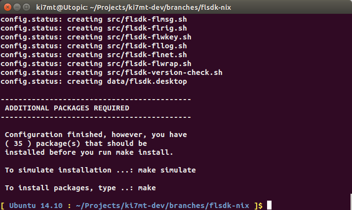
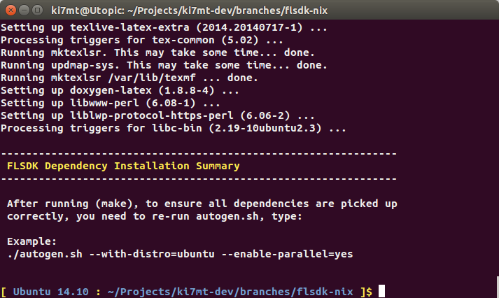
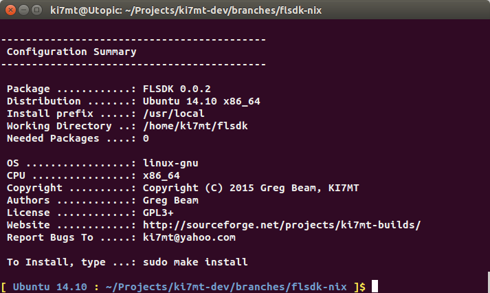
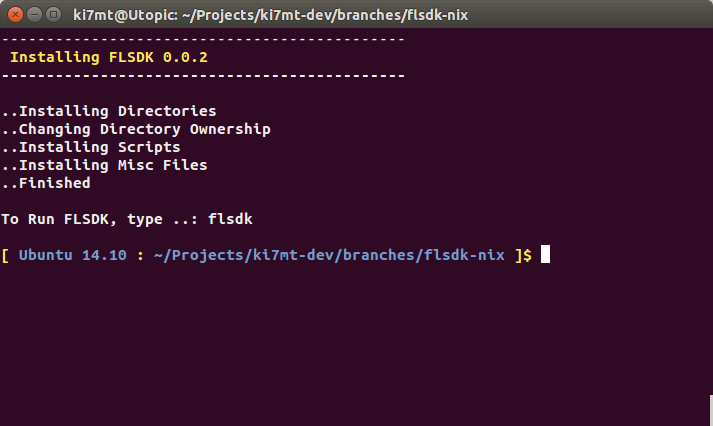
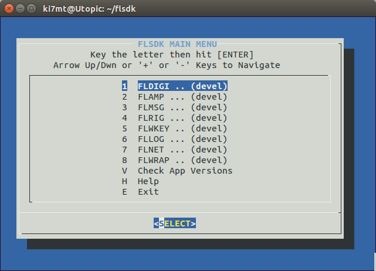
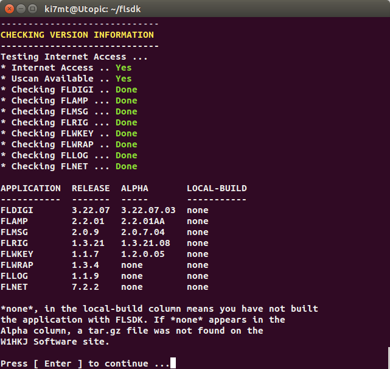
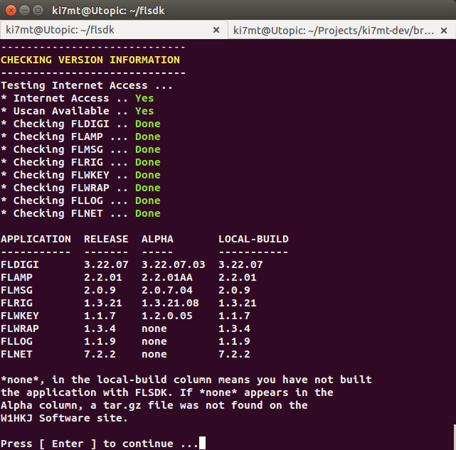

{prog} installation on Ubuntu is farily straight forward. The OS being used for
this section is Ubuntu 14.04 (Utopic) with the Unity desktop. Only an initial
update and upgrade was performed before starting the {prog} installatiion process.

'''

==== ( [red]*Required* ) - Ubuntu Prerequisite Install
Before you can download and install {prog}, you will need a couple packages
in order to proceed. These packages are needed in order to process the {prog}
configuration scripts. The remaining development packages will be 
installed during the make process. If you have not already done so, open a
terminal ( +Ctrl+Alt+T+ )

[source,bash]
-----
# In the terminal, type:
sudo apt-get update

# In the terminal, type ( or copy & paste ):
sudo apt-get install subversion autoconf
-----

'''

==== ( [red]*Required* ) - Ubuntu Download Source Code
At this step, we will make the working ( checkout ) directory, and checkout
{prog} from {sf-ki7mt}. Future versions of the build will simply download a
tar.gz file for compiling.

[source,bash]
-----
# In the terminal, type:
mkdir -p ~/Projects

cd ~/Projects
svn co https://svn.code.sf.net/p/ki7mt-builds/code/branches/flsdk-nix
-----

If there were no errors during the checkout phase, you should have a folder
named *flsdk-nix* with the current version of source code from {sf-ki7mt}.

'''

==== ( [red]*Required* ) - Ubuntu Configure The Build
At this point, we are ready to configure the build in preparation for installing
the needed packages.

[source,bash]
-----
# In the terminal, type:
cd ~/Projects/flsdk-nix

# Now configure the build, type ( or copy & paste )
./autogen.sh --with-distro=ubuntu --enable-parallel=yes

-----

.Configure Screen

[source,bash]
-----
# If there were no errors, type: make -j4
# Note: -j4 is the number of cores your processor has, adjust accordingly
# You should also be asked for your sudo password to perform package installation

make -j4

-----

After running ( make -j4 ), if all went as expected, you will be prompted to
re-run the autogen.sh command. This is to ensure there are no outlying
packages and will perform a final script configuration in preparation
for install.

.After Make

'''

==== ( [red]*Required* ) - Ubuntu Re-Run Configure
[source,bash]
-----
# In the terminal, type ( or copy & paste ):

./autogen.sh --with-distro=debian --enable-parallel=yes

-----

.After 2nd Configure

'''

==== ( [red]*Required* ) - Ubuntu Run Make Install
If there were no errors, it's time to install {prog}.

[source,bash]
-----
# In the terminal, type:

sudo make install

-----

.Final Install

'''

==== .( [red]*Required* ) - Ubuntu Test Installation
If the installation went without error, test that you can launch {prog}.

[source,bash]
-----

# In the terminal, type:

flsdk

-----
.FLSDK Main Menu

If the Main Menu is functional, run the version check.

[source,bash]
-----
# In the Main Menu, select

V Check App Version

-----

.Check App Versions

After building all the the applications, re-run Check App Versions.

.Check App Versions After Build

